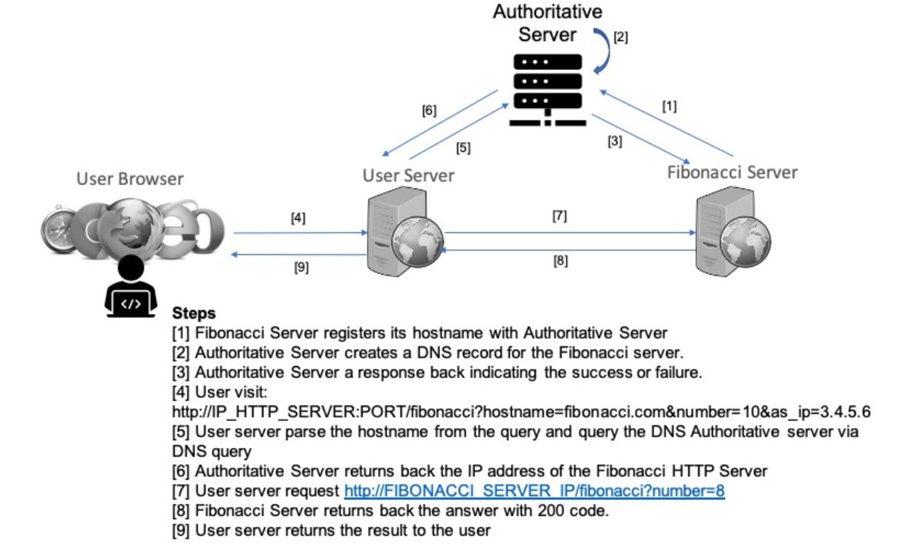

<h1> DNS Implementation </h1>
In this project, I will implement a Authoritative Server for my network of applications. Figure below shows an overview of the system.

Deploying Authoritative Server:
<ul> 
	<li>Open a command prompt window in this directory</li>
	<li>docker network create dns</li>
	<li>cd AS</li>
	<li>docker build -t ytp27/as:latest .</li>
	<li>docker run --network dns --name as -p 53533:53533/udp -it ytp27/as:latest</li>
</ul> 
Deploying Fibonacci Server:
<ul> 
	<li>Open another command prompt window in this directory</li>
	<li>cd FS</li>
	<li>docker build -t ytp27/fs:latest .</li>
	<li>docker run --network dns --name fs -p 9090:9090 -it ytp27/fs:latest</li>
</ul> 
Deploying User Server:
<ul> 
	<li>Open another command prompt window in this directory</li>
	<li>cd US</li>
	<li>docker build -t ytp27/us:latest .</li>
	<li>docker run --network dns --name us -p 8080:8080 -it ytp27/us:latest</li>
</ul> 
Checking the configuration:
<ul> 
	<li>Open another command prompt window in this directory</li>
	<li>docker inspect dns</li>
	<li>Check the ip address of three container: us, fs, as</li>
	
</ul> 

Registering and visiting:
<ul> 
	<li>change the ip address in register_info in sendPutRequest.py to send PUT request to fs to register.</li>
	<li>Open an browser and visit the following url to get the result (change X). http://0.0.0.0:8080/fibonacci?hostname=fibonacci.com&number=13&as_ip=X&as_port=53533</li>
	
</ul>  

How to deploy the whole system on Kubernetes (extra credit):
Be sure that the ibm cloud and kubectl is correctly set.
<ul> 
	<li>kubectl apply -f deploy_dns.yml</li>
</ul> 
get the external ip address on ibm cloud to get the result.
