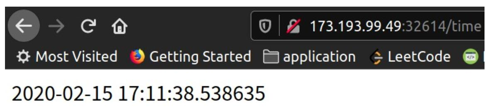

<h1> simple-time-app </h1>
how to run locally:
<ul>
<li>docker build --tag my-python-app .
<li>docker run -d --name python-app -p 8080:8080 my-python-app
<li>in browser open: http://0.0.0.0:8080/
</ul>

Push the image to Docker hub:
<ul>
<li>Login with: “docker login”
<li>Push the image: docker push USERNAME/sample-time-app:latest
<li>Check in dockerhub profile to see the image
</ul>

Now deploy your image to the IBM Cloud K8s instance.
<ul>
<li>Create a deployment: “kubectl create deployment sample-time-app --
image=docker.io/USERNAME/sample-time-app:latest”
<li>Expose your app’s port: “kubectl expose deployment/sample-time-app --
type="NodePort" --port 8080”
<li>Check the exposed port: kubectl get services
<li>Check the IP of your worked node from IBM Cloud
<li>Access the http://IP:NodePort and confirm your app works

Here is the final result:

